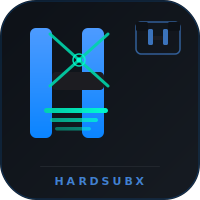

# SubLens

<div align="center">
  
</div>

<div align="center">

**视频字幕提取工具** — 从视频中提取硬编码字幕，输出 SRT / VTT / ASS / JSON 等多种格式。

[](https://opensource.org/licenses/MIT)
[](https://github.com/Agions/SubLens/stargazers)
[](https://tauri.app)
[](https://vuejs.org)
[](https://www.rust-lang.org)

</div>

---

## 功能特性

### 🎯 帧级精度
每个字幕精确映射到视频帧，时间线悬停预览实际画面。

### 🔍 智能导航
- `j` / `k` 键快速跳转，带预览浮层
- 置信度过滤（全部 / 高 / 中 / 低）
- 字幕文本搜索
- 1000+ 字幕虚拟滚动，流畅不卡顿

### 🤖 多引擎 OCR

| 引擎 | 技术 | 精度 | 速度 | 语言 |
|:---|:---|:---:|:---:|:---:|
| **PaddleOCR** | PP-OCRv5 深度学习 | 优秀 | 快（GPU）| 80+ |
| **EasyOCR** | PyTorch | 优秀 | 中等 | 80+ |
| **Tesseract.js** | LSTM + WASM | 良好 | 最快 | 100+ |

### ✨ 智能后处理
- **多轮 OCR** — 同一区域识别多次，取最优结果
- **文本正则化** — 全角/半角标点规范化
- **置信度校准** — 混语/短文本/重复字符自动降权
- **字幕合并** — Levenshtein 相似度智能去重
- **场景检测** — 直方图 + 卡方检验跳过无字幕帧

### 📦 12 种导出格式

| 格式 | 帧映射 | 适用场景 |
|:---|:---:|:---|
| **SRT** | — | 通用播放器 |
| **WebVTT** | — | Web 视频 |
| **ASS** | — | 动漫字幕，高级样式 |
| **SSA** | — | 传统字幕格式 |
| **JSON** | ✅ | 帧级精确编辑 |
| **CSV** | ✅ | 电子表格分析 |
| **TXT** | — | 纯文本 |
| **LRC** | — | 歌词同步 |
| **SBV** | — | YouTube 字幕 |
| **MD** | — | Markdown 文档 |
| **STL** | — | Spruce 字幕 |
| **TTML** | — | Timed Text ML |

### 📋 ROI 预设
底部 · 顶部 · 左侧 · 右侧 · 中间 · 自定义 — 一键切换

### 🎬 支持输入格式
MP4 · MKV · AVI · MOV · WebM · M4V · WMV · FLV · 3GP

---

## 快速开始

```bash
# 克隆仓库
git clone https://github.com/Agions/SubLens.git
cd SubLens

# 安装前端依赖
pnpm install

# 开发模式运行（Rust 后端首次自动编译）
pnpm tauri dev

# 构建生产包
pnpm tauri build
```

### 前置依赖

| 依赖 | 版本 | 说明 |
|:---|:---|:---|
| Node.js | 18+ | 前端构建 |
| Rust | 1.70+ | Tauri 后端 |
| pnpm | 8+ | 包管理器 |
| FFmpeg | 最新 | 视频帧提取 |

---

## 技术栈

| 层级 | 技术 |
|:---|:---|
| 桌面框架 | Tauri 2.x |
| 前端 | Vue 3 + TypeScript |
| 后端 | Rust |
| OCR 引擎 | Tesseract.js (WASM)、PaddleOCR (Native)、EasyOCR |
| 状态管理 | Pinia |
| 构建工具 | Vite |

---

## 项目结构

```
SubLens/
├── src/                         # Vue 3 前端
│   ├── components/             # Vue 组件
│   │   ├── common/             # Button、Modal、Tooltip 等通用组件
│   │   ├── layout/             # ToolBar、SidePanel、VideoPreview
│   │   │   └── tabs/           # Files/Progress/ROI/OCR/Export/Settings 标签页
│   │   ├── video/              # ROISelector、Timeline（缩略图预览）
│   │   └── subtitle/           # SubtitleList、ExportDialog
│   ├── composables/            # 17 个组合式函数（逻辑/UI 分离）
│   │   ├── useSubtitleList.ts  # 字幕过滤、搜索、分页
│   │   ├── useVideoPlayer.ts   # 播放控制、帧捕获
│   │   ├── useOCREngine.ts    # OCR 引擎抽象 + 后处理
│   │   ├── useSubtitleExtractor.ts
│   │   └── useBatchProcessor.ts
│   ├── stores/                 # Pinia 状态管理
│   │   ├── subtitle.ts         # 字幕列表、导出格式、过滤器
│   │   ├── project.ts          # 视频状态、元数据、ROI
│   │   └── settings.ts         # 主题、语言、OCR 偏好
│   └── core/                   # 核心业务逻辑（纯函数，无 Vue 依赖）
│       ├── SubtitlePipeline.ts # 4 阶段 OCR 后处理管道
│       ├── SubtitleExporter.ts # 12 格式导出器
│       ├── SceneDetector.ts    # 直方图 + 卡方场景检测
│       └── ConfidenceCalibrator.ts
│
├── src-tauri/                  # Rust 后端
│   └── src/
│       ├── commands/           # Tauri IPC 命令
│       │   ├── video.rs        # FFmpeg 帧提取、元数据
│       │   ├── ocr.rs          # EasyOCR / Tesseract.js
│       │   ├── ocr_engine.rs   # PaddleOCR Python 桥接
│       │   ├── scene.rs        # 场景检测
│       │   ├── export.rs       # 格式写入
│       │   ├── file.rs         # 文件对话框
│       │   └── system.rs       # 系统依赖诊断
│       └── main.rs             # Tauri 应用入口
│
├── docs/                       # 在线文档（VitePress）
│   ├── index.md                # 文档首页
│   ├── guide/
│   │   ├── getting-started.md  # 安装与首次提取
│   │   ├── architecture.md     # 项目架构与设计
│   │   ├── cli.md              # CLI 参考
│   │   ├── export-formats.md    # 导出格式详解
│   │   ├── keyboard-shortcuts.md
│   │   ├── faq.md              # 常见问题
│   │   └── troubleshooting.md  # 故障排除
│   └── .vitepress/             # VitePress 配置
│
└── cli/                        # Node.js CLI 工具
    └── src/
        ├── extract.ts
        ├── formats.ts
        └── index.ts
```

---

## 核心架构设计

### OCR 后处理管道（SubtitlePipeline）

四阶段纯函数管道，输入原始 OCR 结果，输出清洗后的字幕：

```
Stage 0: normalize      → 文本正则化（CRLF 合并、全角/半角规范化）
Stage 1: filterJitter   → 移除单帧 OCR 噪声
Stage 2: mergeSplit     → 合并因场景跳跃而分裂的相同字幕
Stage 3: mergeSimilar   → 合并时间接近的相似字幕
Stage 4: computeEndTime  → 根据下一条字幕计算精确 endTime
```

每阶段独立可测试，`textSimilarity` 结果按 (文本长度前缀 + 首尾各4字) 缓存，O(n log n) 复杂度。

### 置信度校准（ConfidenceCalibrator）

基于语言脚本（CJK / Latin）的多信号加权校准：

- **惩罚信号**：混语、短文本（<3字）、重复字符、孤立 CJK 字符、引号不平衡、大写误识、尾随逗号
- **奖励信号**：字符多样性、句子完整结尾、合理字幕长度

### 场景检测（SceneDetector）

基于量化 RGB 直方图 + 卡方距离，每帧 O(n) 时间复杂度和 48 计数器内存占用，对光照渐变鲁棒。

---

## License

[MIT License](./LICENSE)
